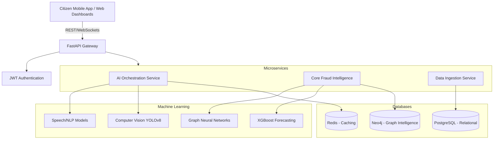

# System Architecture

## High-Level Component Diagram

## Data Flow Diagram: Digital Arrest Scam Detection

1. Citizen receives a suspicious VoIP call.
2. The Citizen Mobile App captures a snippet of the audio locally.
3. Audio is streamed to the FastAPI backend.
4. The AI Orchestration Service routes the audio to the Speech-to-Text model (Whisper).
5. The transcript is analyzed by the NLP Model (DistilBERT) for keywords ("Aadhaar", "Customs", "Money Laundering").
6. The AI engine generates a Confidence Score and Risk Percentage.
7. A WebSocket event is fired back to the Citizen App, triggering a flashing Red SOS Warning.
8. If the risk is >90%, the metadata (phone number) is ingested into Neo4j to update the Fraud Network Intelligence graph.
9. An alert is propagated to the Police Dashboard in real-time.
