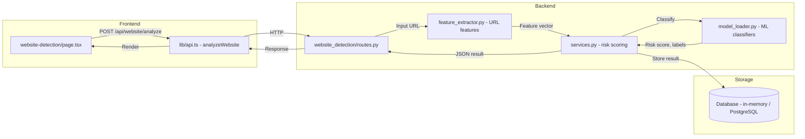
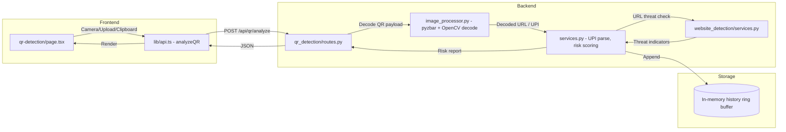

# CyberShield AI – Architecture & Sequence Diagrams

## 1. High-Level System Architecture

```
┌───────────────────────────────────────────────────────────────────┐
│                         FRONTEND (Next.js)                        │
│   pages/                                                          │
│   ├── / (Landing / Dashboard)                                     │
│   ├── /citizen        (Citizen Portal)                            │
│   ├── /police         (Police Portal)                             │
│   ├── /website-detection  (Phishing / Fake Website)               │
│   ├── /currency-detection (Counterfeit Currency)                  │
│   └── /qr-detection       (QR Code Fraud)                        │
│                                                                   │
│   lib/api.ts  ← Axios/fetch wrappers for all backend calls        │
└─────────────────────────┬─────────────────────────────────────────┘
                          │  REST / JSON
                          ▼
┌───────────────────────────────────────────────────────────────────┐
│                        BACKEND (FastAPI)                          │
│   main.py                                                         │
│   ├── /auth           Auth routes (JWT)                           │
│   ├── /dashboard      Dashboard analytics routes                  │
│   ├── /scam           AI Scam Detection routes                    │
│   ├── /voice          AI Voice Scam Detection routes              │
│   ├── /screenshot     Screenshot OCR routes                       │
│   ├── /website        Fake Website Detection routes               │
│   ├── /currency       Counterfeit Currency Detection routes       │
│   └── /qr             QR Code Fraud Detection routes              │
│                                                                   │
│   api/                                                            │
│   ├── routes.py            (global shared routes)                 │
│   ├── model_loader.py      (AI model registry / lazy loading)     │
│   ├── website_detection/                                          │
│   │   ├── schemas.py                                              │
│   │   ├── feature_extractor.py                                    │
│   │   ├── services.py                                             │
│   │   └── routes.py                                               │
│   ├── currency_detection/                                         │
│   │   ├── schemas.py                                              │
│   │   ├── image_processor.py                                      │
│   │   ├── services.py                                             │
│   │   └── routes.py                                               │
│   └── qr_detection/                                               │
│       ├── schemas.py                                              │
│       ├── image_processor.py                                      │
│       ├── services.py                                             │
│       └── routes.py                                               │
│                                                                   │
│   model/                                                          │
│   └── train_model.py    (ML training pipeline)                    │
│                                                                   │
│   tests/                                                          │
│   ├── website_detection/                                          │
│   ├── currency_detection/                                         │
│   └── qr_detection/                                               │
└───────────────────────────────────────────────────────────────────┘
```

---

## 2. Website Detection – Component Diagram (Mermaid)



---

## 3. Website Detection – Sequence Diagram

```
User         Frontend           FastAPI Router    FeatureExtractor    Services     MLModel    DB
 |               |                    |                  |               |             |        |
 |--Upload URL-->|                    |                  |               |             |        |
 |               |---POST /website/-->|                  |               |             |        |
 |               |                   |--extract_features(url)----------->|             |        |
 |               |                   |                  |<-URL features--|             |        |
 |               |                   |---analyze(features)--------------->|             |        |
 |               |                   |                  |               |--predict()-->|        |
 |               |                   |                  |               |<-risk_score--|        |
 |               |                   |                  |               |---store()--->|        |
 |               |                   |<---JSON result---|               |             |        |
 |               |<---200 response---|                  |               |             |        |
 |<--Show result-|                   |                  |               |             |        |
```

---

## 4. Currency Detection – Component Diagram (Mermaid)

```mermaid
flowchart LR
    subgraph Frontend
        CUI[currency-detection/page.tsx]
        CAPI[lib/api.ts - analyzeCurrency]
    end
    subgraph Backend
        CRouter[currency_detection/routes.py]
        ImgProc[image_processor.py - OpenCV preprocessing]
        CSvc[services.py - denomination + authenticity]
        CVModel[CV Model - security feature detection]
    end
    subgraph Storage
        DB2[(Database)]
    end

    CUI -->|POST /api/currency/analyze (image)| CAPI
    CAPI -->|multipart/form-data| CRouter
    CRouter -->|Raw image bytes| ImgProc
    ImgProc -->|Preprocessed image| CSvc
    CSvc -->|Run inference| CVModel
    CVModel -->|Labels: denomination, real/fake, confidence| CSvc
    CSvc -->|Persist| DB2
    CSvc -->|Structured response| CRouter
    CRouter -->|JSON| CAPI
    CAPI -->|Render report| CUI
```

---

## 5. Currency Detection – Sequence Diagram

```
User          Frontend           FastAPI Router    ImageProcessor   Services     CVModel    DB
 |               |                    |                  |               |             |        |
 |--Upload img-->|                    |                  |               |             |        |
 |               |---POST /currency-->|                  |               |             |        |
 |               |                   |--preprocess(img)----------------->|             |        |
 |               |                   |                  |<-processed img-|             |        |
 |               |                   |---detect(img)-------------------->|             |        |
 |               |                   |                  |               |--infer()---->|        |
 |               |                   |                  |               |<-prediction--|        |
 |               |                   |                  |               |---store()---->|       |
 |               |                   |<---JSON result---|               |             |        |
 |               |<---200 response---|                  |               |             |        |
 |<--Show report-|                   |                  |               |             |        |
```

---

## 6. QR Code Detection – Component Diagram (Mermaid)



---

## 7. Cross-Cutting Concerns

| Concern | Approach |
|---------|----------|
| **Authentication** | JWT tokens validated via FastAPI middleware on every protected route |
| **CORS** | FastAPI `CORSMiddleware` configured for frontend origin |
| **Error Handling** | Global exception handlers + Pydantic validation errors return 422 |
| **Logging** | Python `logging` module with structured JSON output |
| **Rate Limiting** | Planned – pluggable via `slowapi` |
| **Model Loading** | `model_loader.py` lazy-loads AI models once and caches them in memory |
| **Testing** | `pytest` + `httpx` for API integration tests per module |

---

*Last updated: July 2026*
